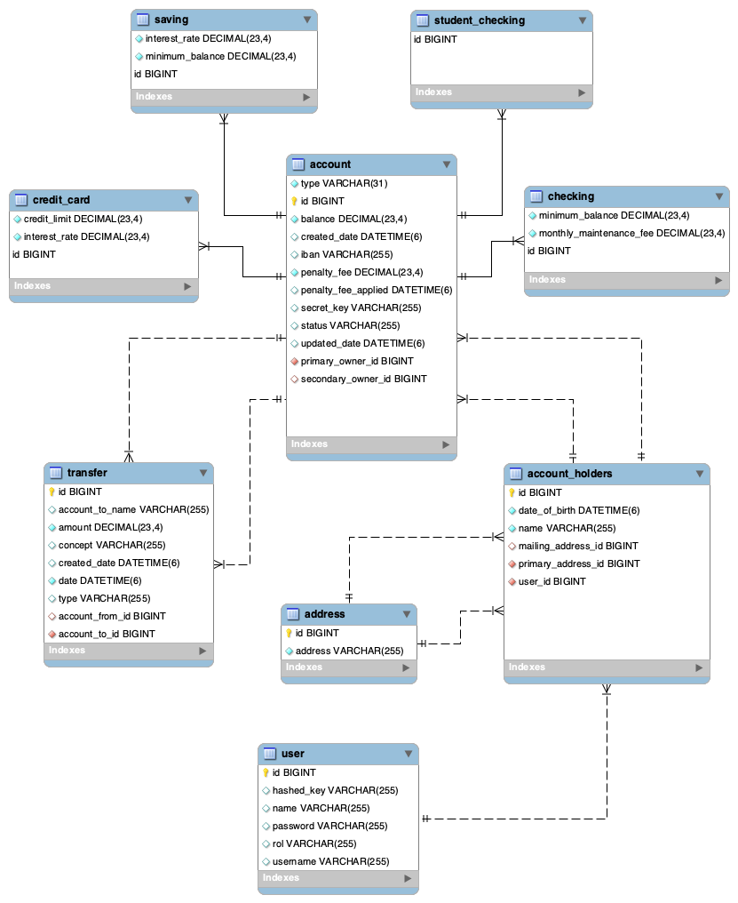
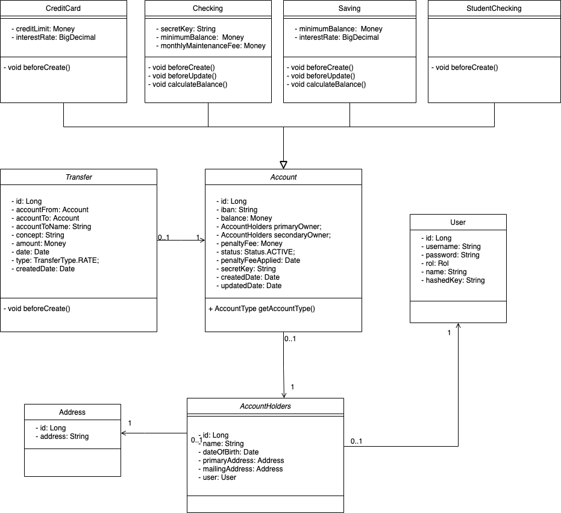

## ¡Bienvenido a Crypto International Bank!
El banco español de crypto monedas con sede en Madrid.

Características de la aplicación.

La aplicación permite crear 4 tipos de cuentas bancarias: StudentChecking, Checking, Savings y CreditCard.

Las cuentas en Crypto International Bank tienen algunas características que debes conocer:

Los mayores de 24 años de edad podrán tener cuentas de tipo Checking, Savings y CreditCard , mientras que los menores de 24 años tendrán una cuenta StudentChecking, pero también pueden tener cuentas de tipos Savings y CreditCard.

###Checking
Las cuentas corrientes tienen un saldo mínimo de €250 y una tarifa de mantenimiento mensual de €12.

###Savings
Las cuentas de ahorro tienen una tasa de interés predeterminada de 0,0025, pero pueden instanciarse con una tasa de interés diferente a la predeterminada, con una tasa de interés máxima de 0.5%
Las cuentas de ahorro deben tener un saldo mínimo predeterminado de €1000, pero pueden crearse instancias de cuentas de ahorro con un saldo mínimo de menos de €1000 pero no menos de 100.

###CreditCard
Las cuentas de tarjeta de crédito tienen un límite de crédito predeterminado de €100, pero se puede instanciar con un creditLimit superior a €100 pero no superior a €100000.
Además, Las tarjetas de crédito tienen una tasa de interés predeterminada de 0,2%, pero se pueden  instanciar con una tasa de interés inferior a 0,2% pero no inferior a 0,1%.

---

###Multas
Existe una penalización fija para todas las cuentas de €40.
Cuando el saldo de una cuenta cae por debajo del saldo mínimo establecido (en este caso €250) se le deducirán automáticamente €40 al saldo de la cuenta. Mientras el saldo de la cuenta permanezca por debajo del saldo mínimo no se aplicara nuevamente la penalización.

###Tasas de interés
Los intereses de las cuentas de ahorro se agregan anualmente al saldo de la cuenta.
Pasado 1 año o más desde la fecha de creada de la cuenta de ahorro se le suman al saldo de la cuenta los intereses obtenidos.
Sin embargo, Los intereses de las tarjetas de crédito se agregan mensualmente al saldo de la cuenta.

###Detección de fraudes
La aplicación reconoce patrones que indican un posible fraude y congela el estado de la cuenta.

Estos patrones de fraude son:
Transacciones realizadas en 24 horas que suman más del 150% de las transacciones totales diarias más altas de los clientes en un período de 7 días.
Más de 2 transacciones que ocurren en una sola cuenta en un período de 1 segundo.

Nota: Si no existen transferencias en la base de datos con fechas de una semana o más para realizar las compararaciones de fecha la tranferencia se realizarán. 

---

###Usuarios de la aplicación
La aplicación tiene 3 tipos de usuarios: administradores y titulares de cuentas(ACCOUNTHOLDERS y THIRDPARTY).

Los administradores son los responsables de crear y eliminar usuarios, titulares de cuentas y nuevas cuentas. Al crear una nueva cuenta, pueden crear cuentas de cheques, ahorros o tarjetas de crédito. Además, pueden acceder al saldo de cualquier cuenta y modificarlo.

Los titulares de cuentas pueden acceder a sus propias cuentas y solo a sus cuentas cuando pasan las credenciales correctas mediante la autenticación básica.
Los titulares de cuentas pueden hacer transferencias de dinero desde cualquiera de sus cuentas a cualquier otra cuenta (independientemente del propietario), proporcionar el nombre del propietario principal o secundario y la identificación de la cuenta que debe recibir la transferencia.

Los Usuarios de terceros también pueden realizar trasferencias a otras cuentas, para ello deben proporcionar su clave hash, cantidad a transferir, la identificación de la cuenta y la clave secreta de la cuenta.

---

###Documentación de la API
Para la documentación de la API se utilizó Swagger:
http://localhost:8080/swagger-ui.html

---

###Diagrama de Base de datos

###Diagrama de Clases

